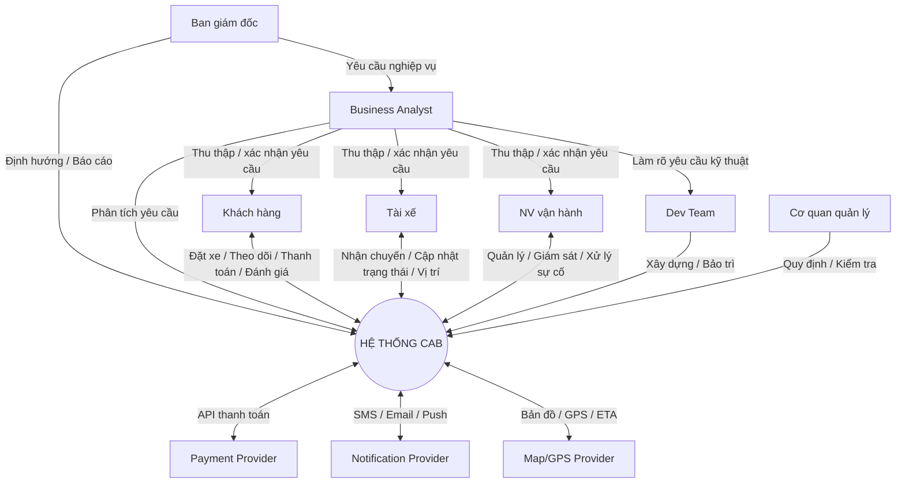

# SRS – Hệ thống CAB (Công ty ABC)

## 1. Stakeholder Analysis

### 1.1 Danh sách stakeholder

| Stakeholder | Vai trò | Ảnh hưởng | Quan tâm | Nhu cầu chính |
|---|---|---|---|---|
| Khách hàng | Người sử dụng dịch vụ | Cao | Cao | Đặt xe nhanh, theo dõi chuyến, thanh toán thuận tiện, bảo mật thông tin |
| Tài xế | Người cung cấp dịch vụ | Cao | Cao | Nhận chuyến phù hợp, cập nhật trạng thái, quản lý thu nhập |
| Nhân viên vận hành | Quản lý hoạt động hằng ngày | Cao | Cao | Theo dõi chuyến/tài xế, xử lý sự cố, quản lý dữ liệu |
| Ban giám đốc | Ra quyết định, định hướng | Rất cao | Cao | Doanh thu, KPI, khả năng mở rộng, hiệu quả vận hành |
| Business Analyst | Phân tích, quản lý yêu cầu | Cao | Cao | Làm rõ yêu cầu, đảm bảo hệ thống đáp ứng nghiệp vụ |
| Development Team | Xây dựng hệ thống | Trung bình | Cao | Yêu cầu rõ ràng, kiến trúc ổn định, khả năng mở rộng |
| Payment Provider | Xử lý thanh toán điện tử | Trung bình | Trung bình | Tích hợp API, bảo mật, xử lý giao dịch chính xác |
| Notification Provider | Cung cấp dịch vụ thông báo | Trung bình | Trung bình | Gửi thông báo ổn định, hỗ trợ nhiều kênh |
| Map/GPS Provider | Cung cấp dữ liệu vị trí | Trung bình | Trung bình | Vị trí chính xác, API ổn định |
| Cơ quan quản lý | Giám sát tuân thủ | Cao | Thấp/TB | Bảo mật dữ liệu, lưu vết, tuân thủ quy định |

### 1.2 Sơ đồ quan hệ



### 1.3 Stakeholder Matrix

| | Quan tâm thấp | Quan tâm cao |
|---|---|---|
| **Ảnh hưởng cao** | Keep Satisfied: Cơ quan quản lý | Manage Closely: Ban giám đốc, Khách hàng, Tài xế, NV vận hành, BA |
| **Ảnh hưởng thấp** | Monitor: Notification Provider, Map/GPS Provider | Keep Informed: Development Team, Payment Provider |

- **Manage Closely** → BA cần trao đổi và xác nhận yêu cầu thường xuyên với nhóm này.
- **Keep Satisfied** → đảm bảo hệ thống luôn tuân thủ quy định.
- **Keep Informed** → cung cấp đầy đủ thông tin về yêu cầu, thay đổi, tích hợp.
- **Monitor** → theo dõi chất lượng dịch vụ và khả năng tích hợp.

---

## 2. Business Goals (BG)

| Mã | Mục tiêu nghiệp vụ | Yêu cầu liên quan |
|---|---|---|
| BG01 | Nền tảng đặt xe phục vụ số lượng lớn khách hàng/tài xế | Khả năng mở rộng, phục vụ lượng người dùng lớn |
| BG02 | Tự động hóa đặt & phân công xe | Giảm thao tác thủ công của NV vận hành |
| BG03 | Theo dõi chuyến đi theo thời gian thực | Tìm tài xế → nhận chuyến → ETA → đón khách → di chuyển → hoàn thành |
| BG04 | Quản lý tập trung dữ liệu khách hàng/tài xế/phương tiện/chuyến | Đăng ký, cập nhật hồ sơ, lịch sử chuyến |
| BG05 | Tối ưu tìm & phân công tài xế | Ưu tiên tài xế gần/phù hợp; tự tìm tài xế khác khi bị từ chối |
| BG06 | Thanh toán thuận tiện, nhiều phương thức | Tiền mặt/điện tử, tính cước sau chuyến |
| BG07 | Không lưu trực tiếp dữ liệu thẻ/tài khoản nhạy cảm | Tích hợp payment provider bên ngoài |
| BG08 | Hệ thống thông báo mở rộng được | Push, SMS, Email, và kênh khác trong tương lai |
| BG09 | Nâng cao hiệu quả giám sát vận hành | Xem chuyến/tài xế, xử lý sự cố, tra cứu giao dịch |
| BG10 | Hỗ trợ ra quyết định bằng dữ liệu | Báo cáo doanh thu, tỷ lệ hoàn thành/hủy, hiệu quả tài xế |
| BG11 | Ổn định & chịu tải cao | Mở rộng độc lập; lỗi thanh toán/thông báo không sập cả hệ thống |
| BG12 | Bảo mật & kiểm soát truy cập | Xác thực, phân quyền, bảo vệ dữ liệu cá nhân/vị trí/giao dịch |
| BG13 | Truy vết khi có sự cố | Lưu vết thao tác quan trọng và lịch sử giao dịch |
| BG14 | Kiến trúc linh hoạt | Dễ thêm dịch vụ/phương thức thanh toán/nhà cung cấp mới |
| BG15 | Làm rõ chính sách trước triển khai | Tính cước, ưu tiên tài xế, thời gian phản hồi, hủy chuyến, lưu trữ dữ liệu |
| BG16 | Triển khai từng phần | Thành phần độc lập, dễ bảo trì, hạn chế ảnh hưởng chức năng đang chạy |

---

## 3. Modules

| Mã | Module | Phạm vi chính |
|---|---|---|
| M01 | Quản lý tài khoản & người dùng | Đăng ký, đăng nhập, cập nhật thông tin, xác thực |
| M02 | Quản lý tài xế & phương tiện | Hồ sơ, phương tiện, trạng thái hoạt động/sẵn sàng |
| M03 | Đặt xe | Điểm đón/đến, loại xe, tạo/hủy yêu cầu |
| M04 | Tìm kiếm & phân công tài xế | Tìm theo vị trí/trạng thái, ưu tiên gần, xử lý từ chối |
| M05 | Quản lý & theo dõi chuyến đi | Trạng thái, vị trí, ETA, theo dõi thời gian thực |
| M06 | Tính cước & thanh toán | Tính tiền, tiền mặt/điện tử, xử lý giao dịch thất bại |
| M07 | Thông báo | Đặt xe, nhận chuyến, tài xế đến, hoàn thành, kết quả thanh toán |
| M08 | Lịch sử & đánh giá | Lịch sử chuyến, số tiền đã trả, đánh giá tài xế |
| M09 | Quản lý vận hành | Quản lý KH/tài xế/phương tiện/chuyến, giám sát, xử lý sự cố |
| M10 | Báo cáo & thống kê | Số chuyến, doanh thu, tỷ lệ hoàn thành/hủy, hiệu quả tài xế |
| M11 | Phân quyền & bảo mật | Xác thực, phân quyền, bảo vệ dữ liệu, audit log |
| M12 | Tích hợp hệ thống bên ngoài | Payment, Map/GPS, Notification Provider |

---

## 4. Business Requirements (BR)

| Mã | Yêu cầu | Mô tả |
|---|---|---|
| BR01 | Đặt xe | Cho phép tạo chuyến bằng điểm đón, điểm đến, loại xe/dịch vụ |
| BR02 | Quản lý tài khoản khách hàng | Đăng ký, đăng nhập, cập nhật thông tin cá nhân |
| BR03 | Tìm kiếm tài xế | Tự động tìm tài xế phù hợp theo vị trí, trạng thái sẵn sàng |
| BR04 | Phân công tài xế | Ưu tiên & gửi yêu cầu đến tài xế phù hợp/gần khách hàng |
| BR05 | Xử lý từ chối/không phản hồi | Tự động tìm tài xế khác khi bị từ chối/không phản hồi đúng hạn |
| BR06 | Thông báo kết quả tìm tài xế | Báo khách hàng khi tìm được/không tìm được tài xế |
| BR07 | Theo dõi chuyến đi | Cho phép xem trạng thái chuyến và vị trí tài xế |
| BR08 | Quản lý trạng thái chuyến | Tài xế cập nhật: đã đến, đã đón khách, đang di chuyển, hoàn thành |
| BR09 | Quản lý vị trí tài xế | Ghi nhận vị trí để hỗ trợ tìm tài xế và tính ETA |
| BR10 | Quản lý tài xế | Đăng ký/tạo tài khoản, cập nhật hồ sơ và trạng thái hoạt động |
| BR11 | Quản lý phương tiện | Quản lý thông tin phương tiện của tài xế |
| BR12 | Tính cước | Tính tiền dựa trên loại dịch vụ và thông tin chuyến |
| BR13 | Thanh toán | Hỗ trợ tiền mặt hoặc điện tử |
| BR14 | Tích hợp thanh toán | Tích hợp payment provider, không lưu trực tiếp dữ liệu thẻ |
| BR15 | Xử lý thanh toán thất bại | Thông báo và cho xử lý lại theo chính sách |
| BR16 | Thông báo | Gửi thông báo các sự kiện quan trọng của chuyến |
| BR17 | Lịch sử chuyến đi | Xem lịch sử và số tiền đã thanh toán |
| BR18 | Đánh giá tài xế | Đánh giá sau khi chuyến hoàn thành |
| BR19 | Quản lý vận hành | Giao diện quản lý KH/tài xế/phương tiện/chuyến cho NV vận hành |
| BR20 | Giám sát chuyến đi | Xem chuyến đang diễn ra và trạng thái tài xế |
| BR21 | Xử lý sự cố | Tra cứu và xử lý chuyến bị lỗi |
| BR22 | Quản lý giao dịch | Tra cứu lịch sử giao dịch và thanh toán |
| BR23 | Báo cáo | Số chuyến, doanh thu, tỷ lệ hoàn thành/hủy, hiệu quả tài xế |
| BR24 | Phân quyền | Kiểm soát quyền truy cập theo vai trò |
| BR25 | Bảo mật dữ liệu | Bảo vệ thông tin cá nhân, phương tiện, vị trí, giao dịch |
| BR26 | Lưu vết | Ghi nhận thao tác quan trọng để kiểm tra/truy vết |
| BR27 | Khả năng mở rộng | Mở rộng độc lập từng thành phần |
| BR28 | Khả năng tích hợp | Thêm nhà cung cấp mới không cần xây lại toàn hệ thống |
| BR29 | Mở rộng dịch vụ | Bổ sung loại dịch vụ đặt xe mới |
| BR30 | Triển khai từng phần | Triển khai chức năng mới từng phần, hạn chế ảnh hưởng hệ thống |

**Chuỗi yêu cầu quan trọng nhất:**
`BR01 → BR03 → BR04 → BR05 → BR07 → (BR12 → BR13 → BR16) & BR18`

---

## 5. Actors & Use Cases

**Actor chính:** Khách hàng, Tài xế, Nhân viên vận hành.
**Hệ thống ngoài:** Payment Provider (xử lý thanh toán, trả kết quả, xử lý lỗi), Map/GPS Provider (vị trí, khoảng cách, ETA), Notification Provider (Push/SMS/Email).

### Khách hàng
UC01 Đăng ký · UC02 Đăng nhập · UC03 Cập nhật thông tin · UC04 Tạo chuyến đi · UC05 Theo dõi chuyến · UC06 Hủy chuyến · UC07 Xem lịch sử chuyến · UC08 Xem cước phí · UC09 Thanh toán · UC10 Xem kết quả thanh toán · UC11 Đánh giá tài xế

### Tài xế
UC12 Đăng ký · UC13 Cập nhật hồ sơ · UC14 Cập nhật phương tiện · UC15 Chuyển trạng thái sẵn sàng · UC16 Nhận thông báo chuyến mới · UC17 Chấp nhận chuyến · UC18 Từ chối chuyến · UC19 Cập nhật trạng thái chuyến · UC20 Cập nhật vị trí · UC21 Hoàn thành chuyến

### Nhân viên vận hành
UC22 Quản lý khách hàng · UC23 Quản lý tài xế · UC24 Quản lý phương tiện · UC25 Quản lý chuyến đi · UC26 Giám sát chuyến đang diễn ra · UC27 Kiểm tra trạng thái tài xế · UC28 Xử lý sự cố · UC29 Tra cứu giao dịch · UC30 Xem báo cáo thống kê · UC31 Quản lý tài khoản & phân quyền

*(Ví dụ chuyển đổi: Nhu cầu doanh nghiệp → BR01 → UC04 Tạo chuyến đi → Actor: Khách hàng → vẽ Use Case Diagram.)*

---

## 6. Quy định nghiệp vụ (Rules)

| Mã | Quy định |
|---|---|
| RULE01 | Khách hàng phải cung cấp điểm đón, điểm đến, loại xe khi đặt xe |
| RULE02 | Ưu tiên tài xế phù hợp và ở gần khách hàng |
| RULE03 | Tài xế từ chối/không phản hồi đúng hạn → tìm tài xế khác |
| RULE04 | Khách hàng phải được báo khi có/không có tài xế nhận chuyến |
| RULE05 | Tài xế phải cập nhật trạng thái chuyến (đến, đón khách, di chuyển, hoàn thành) |
| RULE06 | Cước phí tính theo loại dịch vụ và thông tin chuyến |
| RULE07 | Thanh toán bằng tiền mặt hoặc điện tử |
| RULE08 | Không lưu trực tiếp thông tin nhạy cảm của thẻ/tài khoản |
| RULE09 | Thanh toán điện tử thất bại → báo và cho thử lại theo chính sách |
| RULE10 | Chỉ nhân viên có quyền mới thực hiện chức năng quản trị |
| RULE11 | Thông tin quan trọng/giao dịch phải được lưu vết |
| RULE12 | Bảo vệ thông tin cá nhân, phương tiện, vị trí, giao dịch |

---

## 7. Functional Requirements (FR)

| Mã | Yêu cầu chức năng | Rule liên quan |
|---|---|---|
| FR01 | Nhập điểm đón, điểm đến, chọn loại xe | RULE01 |
| FR02 | Tạo yêu cầu đặt xe, ghi nhận thông tin chuyến | RULE01 |
| FR03 | Tự động tìm tài xế theo vị trí và trạng thái sẵn sàng | RULE02 |
| FR04 | Ưu tiên tài xế gần/phù hợp, gửi yêu cầu nhận chuyến | RULE02 |
| FR05 | Tự động tìm tài xế khác khi bị từ chối/không phản hồi | RULE03 |
| FR06 | Thông báo kết quả tìm tài xế cho khách hàng | RULE04 |
| FR07 | Cho tài xế cập nhật trạng thái chuyến | RULE05 |
| FR08 | Ghi nhận & hiển thị vị trí tài xế, ETA | RULE05 |
| FR09 | Tự động tính cước theo chuyến và loại dịch vụ | RULE06 |
| FR10 | Hỗ trợ thanh toán tiền mặt và điện tử | RULE07 |
| FR11 | Kết nối Payment Provider xử lý thanh toán điện tử | RULE08 |
| FR12 | Không lưu trực tiếp dữ liệu nhạy cảm của thẻ/tài khoản | RULE08 |
| FR13 | Thông báo kết quả thanh toán cho khách hàng | RULE09 |
| FR14 | Cho thực hiện lại giao dịch khi thanh toán thất bại | RULE09 |
| FR15 | Kiểm tra quyền trước khi nhân viên thực hiện chức năng | RULE10 |
| FR16 | Ghi nhận thao tác quan trọng và lịch sử giao dịch | RULE11 |
| FR17 | Kiểm soát quyền truy cập, bảo vệ dữ liệu người dùng | RULE12 |

**Ghi nhớ:** FR = hệ thống phải *làm gì*; NFR = hệ thống phải *hoạt động như thế nào*.

---

## 8. Non-Functional Requirements (NFR)

| Mã | Nhóm | Yêu cầu |
|---|---|---|
| NFR01 | Hiệu năng | Phản hồi nhanh, chịu được nhiều yêu cầu đặt xe đồng thời |
| NFR02 | Khả năng mở rộng | Mở rộng khi số khách hàng/tài xế/chuyến tăng |
| NFR03 | Tính sẵn sàng | Hoạt động ổn định, hạn chế gián đoạn |
| NFR04 | Độ tin cậy | Lỗi thanh toán/thông báo không làm sập toàn hệ thống |
| NFR05 | Bảo mật | Bảo vệ dữ liệu cá nhân, tài xế, vị trí, giao dịch |
| NFR06 | Phân quyền | Người dùng chỉ truy cập chức năng được cấp quyền |
| NFR07 | Audit/Truy vết | Lưu vết thao tác quan trọng để kiểm tra/xử lý sự cố |
| NFR08 | Khả năng bảo trì | Bảo trì/nâng cấp từng phần, hạn chế ảnh hưởng hệ thống |
| NFR09 | Khả năng tích hợp | Dễ tích hợp thêm Payment/Map/Notification Provider |
| NFR10 | Mở rộng dịch vụ | Hỗ trợ dịch vụ và phương thức thanh toán mới |

*Nhóm: Performance (NFR01) · Scalability (NFR02) · Availability & Reliability (NFR03–04) · Security (NFR05–07) · Maintainability (NFR08) · Integration & Extensibility (NFR09–10)*

---

## 9. Entities

| Mã | Entity | Thuộc tính chính |
|---|---|---|
| E01 | Customer | CustomerID, Name, Phone, Email |
| E02 | Driver | DriverID, Name, Phone, Status |
| E03 | Vehicle | VehicleID, PlateNumber, Type, DriverID |
| E04 | Trip | TripID, Pickup, Destination, Status, Time |
| E05 | Booking | BookingID, CustomerID, TripID, VehicleType |
| E06 | DriverAssignment | AssignmentID, TripID, DriverID, Status |
| E07 | Payment | PaymentID, TripID, Amount, Method, Status |
| E08 | Fare | FareID, TripID, ServiceType, Amount |
| E09 | Rating | RatingID, TripID, CustomerID, DriverID, Score |
| E10 | Notification | NotificationID, UserID, Type, Content, Status |
| E11 | Location | LocationID, DriverID, Latitude, Longitude, Time |
| E12 | UserAccount | UserID, Username, Password, Role, Status |
| E13 | AuditLog | LogID, UserID, Action, Time |

**Quan hệ chính:**
```
Customer 1─N Booking     Booking 1─1 Trip        Trip 1─N DriverAssignment
Driver 1─N DriverAssignment   Driver 1─N Vehicle
Trip 1─1 Fare   Trip 1─1 Payment   Trip 1─1 Rating   Driver 1─N Location
UserAccount 1─N AuditLog
```

---

## 10. Acceptance Criteria (AC)

| Mã | Tiêu chí | FR liên quan |
|---|---|---|
| AC01 | Nhập đủ điểm đón, điểm đến, loại xe → cho tạo yêu cầu | FR01 |
| AC02 | Thiếu điểm đón/đến → báo lỗi, không cho tạo yêu cầu | FR01 |
| AC03 | Phải chọn loại xe hợp lệ trước khi tạo yêu cầu | FR01 |
| AC04 | Tạo thành công → hiển thị thông tin chuyến, trạng thái "đang tìm tài xế" | FR02 |
| AC05 | Tài xế từ chối → tự động chuyển sang tài xế phù hợp tiếp theo, không cần khách đặt lại | FR05 |

---

## 11. Ma trận truy vết (BR → FR → AC → UC → Test)

| BR | FR | AC | UC | Test |
|---|---|---|---|---|
| BR01 Đặt xe | FR01 Nhập thông tin chuyến | AC01 Đủ thông tin → tạo chuyến | UC04 Tạo chuyến | TC01 Kiểm tra tạo chuyến |
| BR01 Đặt xe | FR01 Nhập thông tin chuyến | AC02 Thiếu điểm đón → chặn tạo chuyến | UC04 Tạo chuyến | TC02 Kiểm tra thiếu điểm đón |
| BR01 Đặt xe | FR01 Nhập thông tin chuyến | AC03 Thiếu loại xe → chặn tạo chuyến | UC04 Tạo chuyến | TC03 Kiểm tra thiếu loại xe |

*(Cần bổ sung đủ hàng cho các FR còn lại theo cùng mẫu.)*

### Ví dụ test case – Đăng nhập
- **Username:** đúng · sai · trống · không tồn tại · sai định dạng
- **Password:** đúng · sai · trống · sai định dạng · quá dài/ngắn

---

## Luồng phân tích tổng quát
```
Business Goal → Business Requirement (BR) → Use Case (UC) → Actor
Business Rule → Functional Requirement (FR) → Use Case (UC)
Use Case → Entity → thuộc tính/quan hệ → ERD
Requirement → Acceptance Criteria (AC) → nghiệm thu
BR → FR → AC → UC → Test Case (truy vết đầy đủ)
```
